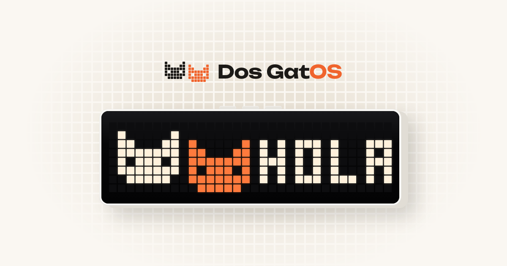

# Dos GatOS

**Alternative firmware for the Ulanzi TC001 pixel clock.** The clock fetches data from the internet
on its own, takes updates from your Mac or browser, and shows apps from a marketplace — weather,
crypto, CI status, merge requests, Home Assistant sensors, your next meeting and more.



**Flash it from your browser: [dosgatos.app/flash](https://dosgatos.app/flash)** — Chrome or Edge on
a computer and a USB cable, nothing to install.

## Features

- **Apps from any JSON API.** An app is a small JSON manifest: which URL to poll, which value to
  take, how to show it. Install ready-made ones from the [marketplace](https://dosgatos.app/marketplace)
  or write your own in the [Studio](https://dosgatos.app/app/studio) with a live preview.
- **Rules, colors and frames.** Change the text, color or icon by the data (red when a pipeline
  fails, blue below zero), tint values on a color scale, show several screens in turn — say, every
  coin of a crypto ticker. See [docs/manifest-v2.md](docs/manifest-v2.md).
- **Works on its own.** With Wi‑Fi set up, the clock polls its apps itself and keeps time over NTP.
  When the Dos GatOS app is around (USB or the same Wi‑Fi network), requests go through it instead.
- **Up to 16 apps**, each with its own icon from the [LaMetric gallery](https://developer.lametric.com/icons),
  color, font and time on screen. The clock keeps its apps and settings, so they follow it from computer to computer.
- **Built in:** a Pomodoro timer, today's date and day countdowns, an ON CALL screen while your Mac's
  microphone or camera is busy, notifications.
- **Three pixel fonts** (3×5, 4×6, 5×7), adjustable brightness and scroll speed; Cyrillic and accented
  text is transliterated.
- **A technical screen** on all three buttons: the IP address and firmware version, or why Wi‑Fi doesn't connect.

## Install

> Before your first flash, keep a backup of the firmware that's on the clock now (the web flasher
> offers one). Flashing is at your own risk.

### From the browser (easiest)

Open **[dosgatos.app/flash](https://dosgatos.app/flash)** in Chrome or Edge, plug the clock in and
follow the steps. It can back up the current firmware first, and keeps the buzzer quiet while it
writes.

### With esptool, from a release

Download `tc001-usb-vX.Y.Z-merged.bin` (first install) or `tc001-usb-vX.Y.Z-app.bin` (update) from
[Releases](../../releases).

```bash
pip install esptool
PORT=$(ls /dev/cu.usbserial-* | head -1)        # macOS; /dev/ttyUSB0 on Linux, COM3 on Windows

# 1. Back up what's on the clock now (4 MB)
esptool --chip esp32 --port $PORT read-flash 0 0x400000 tc001-backup.bin

# 2a. First install: the whole image from 0x0 (erases the clock's settings)
esptool --chip esp32 --port $PORT --baud 460800 write-flash 0x0 tc001-usb-vX.Y.Z-merged.bin

# 2b. Update a clock already on Dos GatOS: only the app, Wi-Fi and settings stay
esptool --chip esp32 --port $PORT --baud 460800 write-flash 0x10000 tc001-usb-vX.Y.Z-app.bin

# Back to the backup
esptool --chip esp32 --port $PORT write-flash 0x0 tc001-backup.bin
```

If the transfer stops halfway, use `--baud 115200`. The TC001's buzzer beeps for as long as esptool
holds the chip in its bootloader — that's expected; the web flasher silences it.

### From source

```bash
pip install platformio
pio run                 # build
pio run -t upload       # build and flash
```

The release images are made by [.github/workflows/build.yml](.github/workflows/build.yml).

## Setting it up

Wi‑Fi, apps, fonts and the clock face are set from the Dos GatOS app:

- **[Web app](https://dosgatos.app/app)** — in Chrome or Edge, over USB (Web Serial). Set up Wi‑Fi here
  and the clock carries on without the computer.
- **Mac app** — also answers sources from your Mac (now playing, calendar, battery, Claude usage) and
  finds the clock on your Wi‑Fi network, no cable needed.

The clock only joins **2.4 GHz** networks.

## Buttons

| | |
|---|---|
| Left / right | previous / next screen |
| Middle, short | refresh the screen now (with the Pomodoro running: pause) |
| Middle, hold | start or stop the Pomodoro timer |
| All three | technical screen: IP address, firmware, Wi‑Fi problems |

A dot in the bottom-right corner tells you how the clock gets its data: none — through the app;
blue — on its own over Wi‑Fi; red — neither. Grey text means the data is stale.

## Documentation

- [docs/sources.md](docs/sources.md) — the fields of an app (source): URL, JSON path, format, icons, headers
- [docs/manifest-v2.md](docs/manifest-v2.md) — values, templates, rules, color scales and frames
- [docs/protocol.md](docs/protocol.md) — how the clock talks to the app over USB and Wi‑Fi

## Known limitations

- On its own over Wi‑Fi the clock doesn't verify HTTPS certificates (there's no root store in the
  firmware). Fine for public data; keep secrets out of apps the clock fetches itself.
- The Wi‑Fi link to the app has no authentication yet. Anyone on your network could drive the
  clock; the clock refuses Wi‑Fi settings over the network for that reason.
- Icons reach the clock through the app; a clock that never met the app shows apps without icons.
- Fonts are ASCII only; other scripts are transliterated where possible, the rest shows as `?`.

## License

Dos GatOS firmware is **source-available for noncommercial use** under the
[PolyForm Noncommercial License 1.0.0](LICENSE): you may use, copy, change and share it for personal,
hobby, research, education and other noncommercial purposes, and charities, schools and public bodies
may use it too. Selling it, shipping it on devices you sell, or using it in a commercial product needs
a separate license — open an issue to ask.

Third-party libraries built into the firmware keep their own licenses — see
[THIRD_PARTY_NOTICES.md](THIRD_PARTY_NOTICES.md).

Not affiliated with Ulanzi. Ulanzi and TC001 are trademarks of their respective owners.
